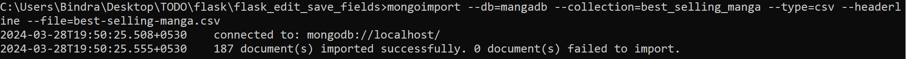
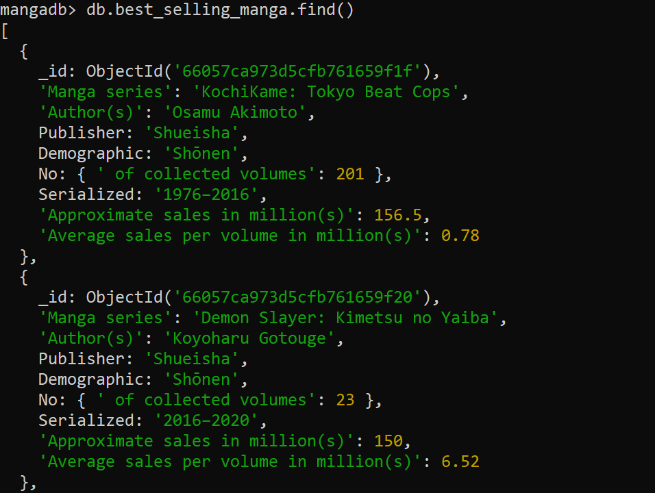

Best Selling Manga Edit Web-APP
-------------------------------

- Downloaded data from Kaggale for this here is the link:- https://www.kaggle.com/datasets/drahulsingh/best-selling-manga?resource=download

- Download database tools:- https://www.mongodb.com/try/download/database-tools
- mongoimport is not available bydefault. We have to make it available manually
- Run mongoimport from the system command line, not the mongo shell
# Step - 1
- extract zip and copy mongoimport.exe file and past into "C:\Users\Bindra\Downloads\mongodb-database-tools-windows-x86_64-100.9.4\mongodb-database-tools-windows-x86_64-100.9.4\bin" location
- Run Below command after above step
- `mongoimport --db=mangadb --collection=best_selling_manga --type=csv --headerline --file=best-selling-manga.csv`
- 

# Step - 2
- To check wheather data is inserted or not.
- 

- `os.urandom(24).hex()` this how we can generate scrate key

